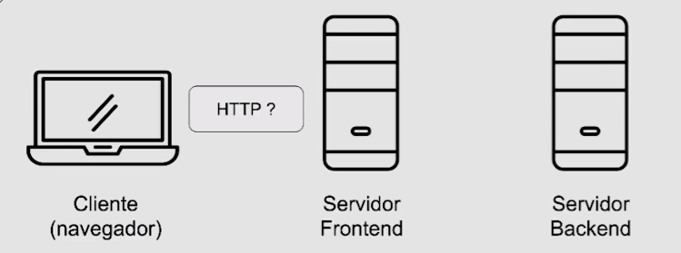
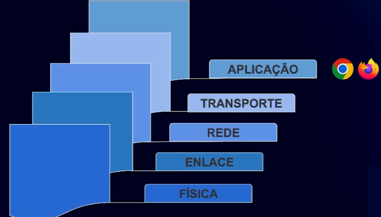
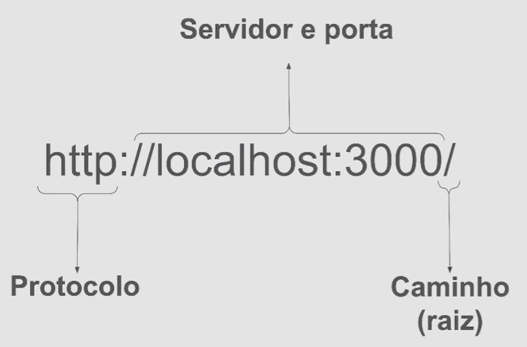

### Conhecendo o protocolo HTTP

HTTP - Hyper Text Transfer Protocol é um protocolo de comunicação utilizado para transferir dados na web

**Arquitetura:**

o http é um protocolo da camada de aplicação

O HTTP foi criado para estabelecer regras de comunicação entre o modelo Cliente-Servidor que funciona na Web.

Para ilustrar: se você compreende este texto, é porque sabe português! Para que alguém consiga se comunicar com você, essa pessoa deverá usar o português também (supondo que você desconheça outro idioma). Isso significa que sua regra (protocolo) de comunicação com o mundo é a língua portuguesa, que define a forma com que as informações devem chegar até você (através do vocabulário, da gramática etc.). Uma outra pessoa que conheça português vai usar o mesmo formato, já que vocês têm um idioma em comum.

Na internet, como já vimos, o "idioma" mais comum é o HTTP. Ele é responsável por definir a forma de como os dados são trafegados na rede através de várias regras. Portanto, todo mundo que conhece o idioma HTTP poderá receber, enviar dados e participar dessa conversa!

### URL's

Localizador de Recursos Universal

- Permite acessar arquivos, html por exemplo, universalmentes seja pelos servidores, celular, desktop

*Recurso é o que vem depois do nome do servidor

