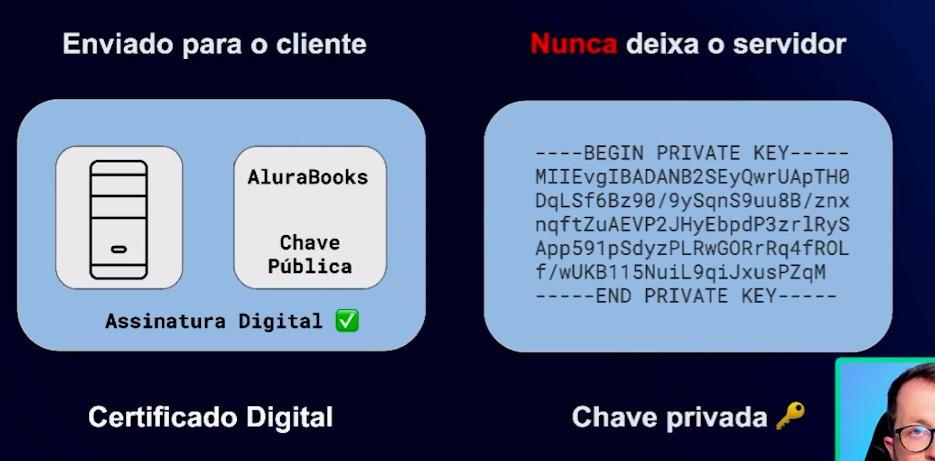
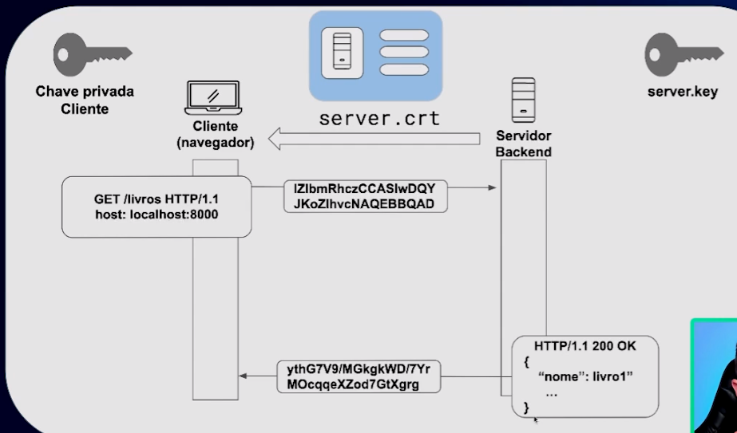

### Conhecendo o protocolo HTTP

HTTP - Hyper Text Transfer Protocol é um protocolo de comunicação utilizado para transferir dados na web

**Arquitetura:**

o http é um protocolo da camada de aplicação

O HTTP foi criado para estabelecer regras de comunicação entre o modelo Cliente-Servidor que funciona na Web.

Para ilustrar: se você compreende este texto, é porque sabe português! Para que alguém consiga se comunicar com você, essa pessoa deverá usar o português também (supondo que você desconheça outro idioma). Isso significa que sua regra (protocolo) de comunicação com o mundo é a língua portuguesa, que define a forma com que as informações devem chegar até você (através do vocabulário, da gramática etc.). Uma outra pessoa que conheça português vai usar o mesmo formato, já que vocês têm um idioma em comum.

Na internet, como já vimos, o "idioma" mais comum é o HTTP. Ele é responsável por definir a forma de como os dados são trafegados na rede através de várias regras. Portanto, todo mundo que conhece o idioma HTTP poderá receber, enviar dados e participar dessa conversa!

### URL's

Localizador de Recursos Universal

- Permite acessar arquivos, html por exemplo, universalmentes seja pelos servidores, celular, desktop

*Recurso é o que vem depois do nome do servidor

*Portas padrão

### Sistema de Nomes de Domínios (DNS)

- Servidores DNS transformam requisições de nomes em endereços IP

> **Domínios**: cada site/sistema possui seu próprio domínio. exemplo: sistema da Alura está sobre o dominio alura.com.br.
> - Domínios globais: Alura;
> - Domínios locais: localhost.

> cmd: comando nslookup - retorna o ip desejado

### DNS é hierárquico

Quando acessamos algo .com.br ou .org, significa que são o primeiro nível dos nomes dos sites. Inicia-se da raiz (nível mais abstrato) que é para ter um ponto de onde começar, e a partir disso vamos descendo os níveis. Chamamos esse nível de top-level domains (TLD).

### Inspecionando

**Telnet**:  conexão TCP com back-end e o TCP será usado pelo HTTP para transportar as mensagens.

**Métodos HTTP**: 

Esses métodos HTTP são tão comuns que foi criado um acrônimo, conforme seus significados em inglês, o CRUD:

C: create
R: read
U: update
D: delete

> stateless: servidor não se lembra do que aconteceu em requisições anteriores.

**Códigos de status**:

[PDF de erros](https://www.rfc-editor.org/rfc/rfc7231)

Os códigos que começam com o número 1 são raramente usados, encontraremos o status "101 Switching Protocols".

Os códigos iniciados com o número 2 indicam operações bem-sucedidas. É o caso do "200 OK".

Os códigos que começam com o número 3 indicam redirecionamentos. Por exemplo, caso uma empresa mude de nome e o domínio de seu site seja alterado, ela pode usar um redirecionamento.

O HTTP tem duas entidades conversando: o cliente e o servidor. Os códigos que começam com o número 4 indicam erros provindos do lado do cliente, como "400 Bad Request" e "401 Unauthorized".

Já os códigos iniciados com o número 5 indicam erros do lado do servidor. Você provavelmente já se deparou com o código "500 Internal Server Error" (erro interno do servidor), quando algum site estava com problemas. No caso de erros, os servidores são configurados para responder com códigos iniciados com 5.

**Protegendo o ambiente Web com HTTPS**

- Openssl: permite gerar certificados digitais e chaves privadas

- Wireshark: verificar requisições feitas localmente  
Observa  o que passa pela rede do nosso computador

> **Certificado digital e chave privada e pública**: 

Imagine que você trabalha na modalidade presencial e precisa acessar o prédio onde fica a sede da empresa.

Para fazer isso, você apresenta o seu documento de identidade para uma autoridade que verifica quem pode entrar. Uma vez dentro do prédio, você usa uma chave para abrir a porta do escritório de trabalho.

É importante dizer que você jamais faria uma cópia da chave do seu escritório, pois poderia compartilhar informações sensíveis.

A chave e o certificado usados no nosso projeto funcionam de maneira similar: no lugar do documento de identidade, usamos um Certificado Digital. Trata-se de um documento com informações da sua API, sendo elas a identidade da organização, a chave pública e a assinatura digital.

O servidor mostra o Certificado Digital para o cliente em um processo de autenticação. Além disso, também contamos com uma chave privada que o servidor usa para proteger os dados. Esta chave nunca deixa o servidor.

Se essa chave deixasse o servidor, outros clientes poderiam descriptografá-la e descobrir os dados de outras pessoas.

**Controlando o HTTP**

No get usamos o que chamamos de query params, como, por exemplo, o /livros?categoria=1 (passamos direto na URL). No post, enviamos os parâmetros pelo corpo da mensagem, porque são dados maiores, usando o formato JSON, XML, etc.

> Formato dos dados: determinado pelo cabeçalho Content-Type (formato do corpo da mensagem)e o Accept (utilizado na requisição).